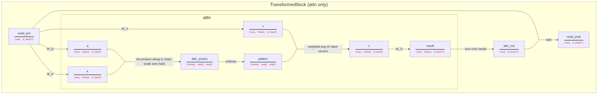

```mermaid
graph TD
subgraph "<span style='font-size:24px'>TransformerBlock (attn only)</span>"
    classDef empty width:0px,height:0px;
    classDef code color:red;

    resid_pre["resid_pre<div style='border-top:2px solid black;margin-top:4px'></div><code style='color:red;font-size:12px'>(seq, d_model)</code>"]---D[ ]:::empty-->|add|resid_post
    
    subgraph "<span style='font-size:24px'>attn &emsp; &emsp; &emsp;&emsp; &emsp; &emsp; &emsp; &emsp; &emsp; &emsp; &emsp;&emsp;&emsp;&emsp;&emsp;&emsp;&emsp;&emsp;&emsp;&emsp;</span>"
        v
        q
        k
        attn_scores
        F
        pattern
        G
        z
        result
    end
    resid_pre-->|W_V|v["v<div style='border-top:2px solid black;margin-top:4px'></div><code style='color:red;font-size:12px'>(seq, nhead, d_head)</code>"]---G[ ]:::empty-->|weighted avg of value vectors|z["z<div style='border-top:2px solid black;margin-top:4px'></div><code style='color:red;font-size:12px'>(seq, nhead, d_head)</code>"] --> |W_O|result["result<div style='border-top:2px solid black;margin-top:4px'></div><code style='color:red;font-size:12px'>(seq, nhead, d_model)</code>"] -->|sum over heads|attn_out["attn_out<div style='border-top:2px solid black;margin-top:4px'></div><code style='color:red;font-size:12px'>(seq, d_model)</code>"]---D
    resid_pre-->|W_Q|q["q<div style='border-top:2px solid black;margin-top:4px'></div><code style='color:red;font-size:12px'>(seq, nhead, d_head)</code>"]---F[ ]:::empty-->|dot product along d_head, scale and mask|attn_scores["attn_scores<div style='border-top:2px solid black;margin-top:4px'></div><code style='color:red;font-size:12px'>(nhead, seqQ, seqK)</code>"]-->|softmax|pattern["pattern<div style='border-top:2px solid black;margin-top:4px'></div><code style='color:red;font-size:12px'>(nhead, seqQ, seqK)</code>"]---G
    resid_pre-->|W_K|k["k<div style='border-top:2px solid black;margin-top:4px'></div><code style='color:red;font-size:12px'>(seq, nhead, d_head)</code>"]---F
    
    resid_post["resid_post<div style='border-top:2px solid black;margin-top:4px'></div><code style='color:red;font-size:12px'>(seq, d_model)</code>"]
    
end
```

test

  

```mermaid
graph TD
subgraph "<span style='font-size:24px'>TransformerBlock (attn only)</span>"
    classDef empty width:0px,height:0px;
    classDef code color:red;

    resid_pre["resid_pre<div style='border-top:2px solid black;margin-top:4px'></div><code style='color:red;font-size:12px'>(seq, d_model)</code>"]---D[ ]:::empty-->|add|resid_post
    
    subgraph "<span style='font-size:24px'>attn &emsp; &emsp; &emsp;&emsp; &emsp; &emsp; &emsp; &emsp; &emsp; &emsp; &emsp;&emsp;&emsp;&emsp;&emsp;&emsp;&emsp;&emsp;&emsp;&emsp;</span>"
        v
        q
        k
        attn_scores
        F
        pattern
        G
        z
        result
    end
    resid_pre-->|W_V|v["v<div style='border-top:2px solid black;margin-top:4px'></div><code style='color:red;font-size:12px'>(seq, nhead, d_head)</code>"]---G[ ]:::empty-->|weighted avg of value vectors|z["z<div style='border-top:2px solid black;margin-top:4px'></div><code style='color:red;font-size:12px'>(seq, nhead, d_head)</code>"] --> |W_O|result["result<div style='border-top:2px solid black;margin-top:4px'></div><code style='color:red;font-size:12px'>(seq, nhead, d_model)</code>"] -->|sum over heads|attn_out["attn_out<div style='border-top:2px solid black;margin-top:4px'></div><code style='color:red;font-size:12px'>(seq, d_model)</code>"]---D
    resid_pre-->|W_Q|q["q<div style='border-top:2px solid black;margin-top:4px'></div><code style='color:red;font-size:12px'>(seq, nhead, d_head)</code>"]---F[ ]:::empty-->|dot product along d_head, scale and mask|attn_scores["attn_scores<div style='border-top:2px solid black;margin-top:4px'></div><code style='color:red;font-size:12px'>(nhead, seqQ, seqK)</code>"]-->|softmax|pattern["pattern<div style='border-top:2px solid black;margin-top:4px'></div><code style='color:red;font-size:12px'>(nhead, seqQ, seqK)</code>"]---G
    resid_pre-->|W_K|k["k<div style='border-top:2px solid black;margin-top:4px'></div><code style='color:red;font-size:12px'>(seq, nhead, d_head)</code>"]---F
    
    resid_post["resid_post<div style='border-top:2px solid black;margin-top:4px'></div><code style='color:red;font-size:12px'>(seq, d_model)</code>"]
    
end
```

